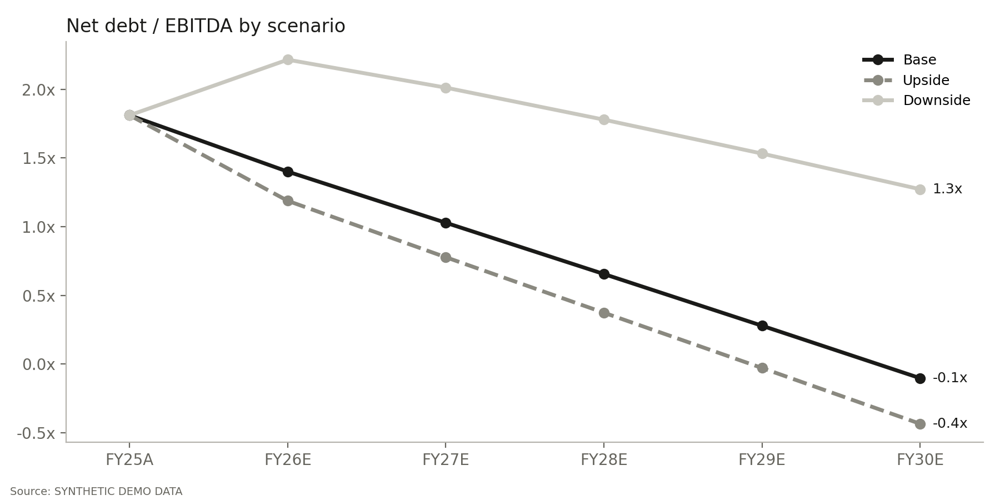

# Three-Statement Financial Model

**Author:** Alessandro Radice · M.Sc. Economics and Business Law (Finance), Università Cattolica del Sacro Cuore, Milan

**Income statement, balance sheet and cash flow, fully linked, in three scenarios.**
A Python model that turns three years of historicals into five years of projections. The three statements tie out every year, a revolver funds any cash shortfall, and one switch moves the whole **Excel model with live formulas** between Base, Upside and Downside.



---

## Objective

Every valuation, LBO, merger model and credit memo sits on a three-statement model. It is the first thing a banking analyst builds, and the first thing a VP checks: does the balance sheet balance, does the cash tie, and what happens to liquidity if the plan goes wrong?

This project has three goals:

1. **Build the core model properly.** Driver-based projections where every balance sheet line has a source: working capital from days, PP&E from capex and D&A, debt from its schedule, equity from retained earnings.
2. **Stress it.** Three scenarios on growth, margins and working capital, with a revolver that shows how much liquidity the downside really needs.
3. **Deliver it in banker format.** An auditable Excel model with a scenario switch, balance checks on every column, and results that reconcile exactly with the Python engine.

---

## What it does

| Step | Module | What it produces |
|---|---|---|
| 1 | **Historicals** | Three years of income statement and balance sheet, reclassified into a standard template that balances exactly (Yahoo Finance, or a synthetic demo company) |
| 2 | **Drivers** | Revenue growth, COGS and SG&A margins, DSO / DIO / DPO for each scenario; D&A, capex, tax, interest rates, amortisation, dividends and minimum cash as policy |
| 3 | **Income statement** | Revenue to net income; interest on opening debt and cash balances, so the model has no circular reference |
| 4 | **Balance sheet** | Receivables, inventory and payables from days; PP&E roll-forward; term debt schedule; revolver; retained earnings |
| 5 | **Cash flow** | Cash from operations, investing and financing; the revolver draws when cash would fall below the minimum and repays when cash allows |
| 6 | **Checks** | Assets − liabilities − equity and cash (balance sheet vs cash flow) on every column, all zero |
| 7 | **Credit & cash flow** | Free cash flow, net debt, net debt / EBITDA, EBITDA / interest and revolver usage for each scenario |
| 8 | **Exports** | Excel model with live formulas and a scenario switch, plus a leverage chart |

### The Excel model (5 sheets)
`Inputs` · `Income Statement` · `Balance Sheet` · `Cash Flow` · `Summary`

- **Scenario switch:** one cell on `Inputs` (1 = Base, 2 = Upside, 3 = Downside) drives every statement through `CHOOSE`.
- Banker colour code: **blue** = hard-coded input, **black** = formula, **green** = link to another sheet.
- 373 formulas, a balance check under the balance sheet and a cash check under the cash flow, both showing "OK".

---

## Demo result (synthetic data)

Demo Co. starts FY25 with $4,750m of revenue, $884m of EBITDA and 1.8x net debt / EBITDA.

| | Base | Upside | Downside |
|---|---|---|---|
| Revenue, FY30 | $5,891m | $6,475m | $4,911m |
| EBITDA margin | 19.0% | 20.0% | 15.5% |
| Cumulative free cash flow, FY26–30 | $2,464m | $2,912m | $1,381m |
| Net debt / EBITDA, FY30 | net cash (−0.1x) | net cash (−0.4x) | 1.3x |
| Peak revolver draw | none | none | $83m |
| Minimum EBITDA / interest | 8.3x | 9.0x | 6.2x |

In the downside, a 4% revenue drop, weaker margins and slower collections absorb $107m of working capital in the first year. Cash hits the $250m minimum and the revolver draws $66m, peaking at $83m in FY28 before the business pays it down. In the projections, net leverage peaks at 2.2x, in the downside in FY26.

---

## What you need

| Requirement | Details |
|---|---|
| **Environment** | A Google account to run the notebook in [Google Colab](https://colab.research.google.com), free tier is enough. It also runs in any local Jupyter with Python 3.10+. |
| **Python libraries** | `pandas`, `numpy`, `matplotlib`, `yfinance`, `xlsxwriter`. The first cell installs the missing ones. |
| **Data** | Yahoo Finance via `yfinance`: income statement, balance sheet and cash flow. No API key and no paid subscription. |
| **Optional data** | The latest 10-K for a clean reclassification, and management guidance or broker estimates for the drivers. |
| **To open the outputs** | Microsoft Excel or Google Sheets. |
| **Background knowledge** | How the three statements link, working-capital days, debt schedules. |

---

## How to run it

1. Open `Three_Statement_Model.ipynb` in Google Colab.
2. In the **Configuration** cell, set the company: `TICKER = "GIS"`.
3. Adjust the scenario drivers in `DRIVERS` and the financing assumptions in `POLICY`. In live mode, D&A, capex, dividends and minimum cash are calibrated to the company's latest year.
4. `Runtime → Run all`. The Excel model and the chart download automatically.
5. In Excel, change `Inputs!C5` to 1, 2 or 3 to switch scenario.

**Offline mode:** `DATA_MODE = "demo"` runs on a synthetic company. The notebook also falls back to demo mode if Yahoo Finance is unreachable, and every output is then labelled *SYNTHETIC DEMO DATA*.

---

## Methodology & validation

- **No circularity:** interest expense and interest income use opening balances, a standard way to keep the model stable without iterative calculation.
- **Revolver:** draw = max(−opening revolver, minimum cash − cash before revolver). The same line both draws and repays.
- **Balance:** cash comes only from the cash flow statement and equity only from retained earnings, so the balance sheet balances by construction, and the check proves it.
- **Reconciliation:** the Excel file was recalculated once per scenario with the switch set to 1, 2 and 3. Revenue, EBITDA, net income, interest, cash, revolver, term debt, receivables and equity match the Python engine exactly (differences are floating-point rounding only), with zero formula errors and all checks at zero.

## Limitations

- Yahoo Finance statements are reclassified automatically; other long-term assets are folded into goodwill & intangibles and other liabilities into one line.
- Working-capital days are applied to year-end balances; no seasonality or quarterly model.
- Term debt amortises on a fixed schedule; in live mode maturities are assumed refinanced unless an amortisation is set.
- No share buybacks, acquisitions or leases modelled separately.

This project is for educational purposes and is not investment advice.

---

## Repository structure

```
├── Three_Statement_Model.ipynb        # the notebook (run this)
├── three_statement.py                 # same code as a plain Python script
├── DEMO_three_statement_model.xlsx    # sample Excel model (synthetic data)
├── Three_Statement_Model_Deck.pdf     # project presentation
├── leverage.png                       # sample chart
└── README.md
```

## Stack

`Python` · `pandas` · `numpy` · `yfinance` · `matplotlib` · `xlsxwriter` · Google Colab
